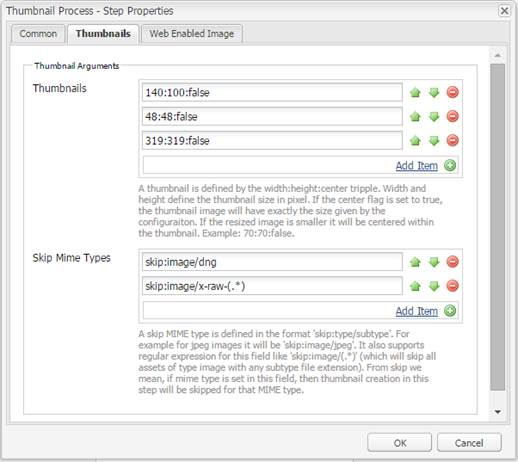

# Process images using Camera Raw {#camera-raw-support}

You can enable the [!DNL Adobe Camera Raw] support to process raw file formats, such as CR2, NEF, and RAF, and render the images in JPEG format. The functionality is supported in [!DNL Adobe Experience Manager Assets] using the [Camera Raw package](https://www.adobeaemcloud.com/content/marketplace/marketplaceProxy.html?packagePath=/content/companies/public/adobe/packages/aem630/product/assets/aem-assets-cameraraw-pkg) available via Package Share.

>[!NOTE]
>
>The functionality supports only JPEG renditions. It is supported on Windows 64 bit, Mac OS, and RHEL 7.x.

To enable [!DNL Camera Raw] support in [!DNL Experience Manager Assets], follow these steps:

1. Download the [Camera Raw package](https://www.adobeaemcloud.com/content/marketplace/marketplaceProxy.html?packagePath=/content/companies/public/adobe/packages/aem630/product/assets/aem-assets-cameraraw-pkg) from the Package Share.
1. Access `https://[aem_server]:[port]/workflow`. Open the **[!UICONTROL DAM Update Asset]** workflow.
1. Open the **[!UICONTROL Process Thumbnails]** step.
1. Provide the following configuration in the **[!UICONTROL Thumbnails]** tab:

    * **[!UICONTROL Thumbnails]**: `140:100:false, 48:48:false, 319:319:false`
    * **[!UICONTROL Skip Mime Types]**: `skip:image/dng, skip:image/x-raw-(.*)`

   

1. In the **[!UICONTROL Web Enabled Image]** tab, in the **[!UICONTROL Skip List]** field, specify `audio/mpeg, video/(.*), image/dng, image/x-raw-(.*)`.

   

1. From the side panel, add the **[!UICONTROL Camera Raw/DNG Handler]** step below the **[!UICONTROL Thumbnail creation]** step.
1. In the **[!UICONTROL Camera Raw/DNG Handler]** step, add the following configuration in the **[!UICONTROL Arguments]** tab:

   * **[!UICONTROL Mime Types]**: `image/dng` and `image/x-raw-(.*)`
   * **[!UICONTROL Command]**:

     * `DAM_Raw_Converter ${directory}/${filename} ${directory} cq5dam.web.1280.1280.jpeg 1280 1280`
     * `DAM_Raw_Converter ${directory}/${filename} ${directory} cq5dam.thumbnail.319.319.jpeg 319 319`
     * `DAM_Raw_Converter ${directory}/${filename} ${directory} cq5dam.thumbnail.140.100.jpeg 140 100`
     * `DAM_Raw_Converter ${directory}/${filename} ${directory} cq5dam.thumbnail.48.48.jpeg 48 48`

   

1. Click **[!UICONTROL Save]**.

>[!NOTE]
>
>Ensure that the above configuration is the same as the **[!UICONTROL Sample DAM Update Asset With Camera RAW and DNG Handling Step]** configuration.

You can now import camera raw files into Assets. After you install the Camera RAW package and configure the required workflow, **[!UICONTROL Image Adjust]** option appears in the list of side panes.

   

   *Figure: Options in the side pane.*

   

   *Figure: Use option to make lightweight edits to your images.*

After saving the edits to a [!DNL Camera Raw] image, a new rendition `AdjustedPreview.jpg` is generated for the image. For other image types except [!DNL Camera Raw], the changes are reflected in all the renditions.

## Best practices, known issues, and limitations {#best-practices}

The functionality has the following limitations:

* The functionality supports only JPEG renditions. It is supported on Windows 64 Bit, Mac OS, and RHEL 7.x.
* Metadata writeback is not supported for RAW and DNG formats.
* The [!DNL Camera Raw] library has limitations around the total pixels it can process at a time. Currently, it can process a maximum of 65000 pixels on the long side of a file or 512 MP whatever criteria is encountered first.
