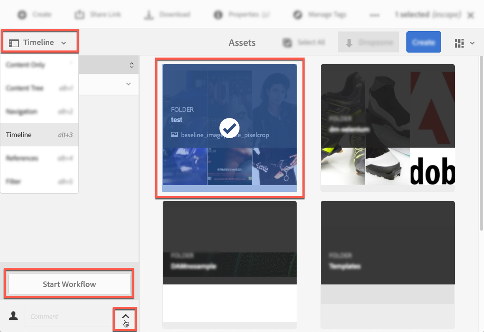
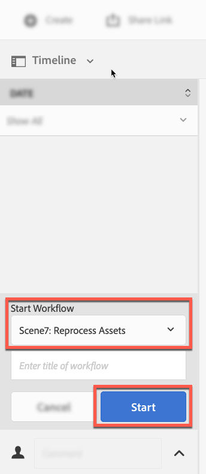

# Profiles for Processing Metadata, Images, and Videos{#profiles-for-processing-metadata-images-and-videos}

A profile is a recipe for what options to apply to assets that get uploaded to a folder. For example, you can specify what metadata profile and video encoding profile to apply to video assets that you upload. Or, what imaging profile to apply to image assets to have them properly cropped.

Those rules can include adding metadata, smart cropping of images, or establishing video encoding profiles. In AEM, you can create three types of profiles, which are covered in detail at the following links:

* [Metadata profiles](/help/assets/metadata-profiles.md)
* [Image profiles](/help/assets/image-profiles.md)
* [Video profiles](/help/assets/video-profiles.md)

You must have Administrator rights to create, edit, and delete metadata, image, or video profiles.

After you create your metadata, image, or video profile, you assign it to one or more folders that you use as the destination for newly uploaded assets.

See also [Best Practices for Organizing your Digital Assets for using Processing Profiles](/help/assets/best-practices-for-file-management.md).

>[!NOTE]
>
>Assets that you move from one folder to another do not get reprocessed. For example, suppose you have Folder 1 that has profile A assigned to it and Folder 2 that has profile B assigned to it. If you move assets from Folder 1 to Folder 2, the moved assets retain their original processing from Folder 1.
>
>The same is true even when you move assets between two folders that have the same profile assigned to it.

## Reprocessing assets in a folder after you have edited its processing profile {#reprocessing-assets-in-a-folder-after-you-have-edited-its-processing-profile}

>[!NOTE]
>
>Applies only to *Dynamic Media - Scene7 mode* in AEM 6.4.6.0 or later and AEM 6.5.2.0 or later.

You can reprocess assets in a folder that already has an existing processing profile that you later changed.

For example, suppose you created an Image profile and assigned it to a folder. Any image assets you uploaded to the folder automatically had the Image profile applied to the assets. However, later you decide to add a new smart crop ratio the profile. Now, instead of having select and reupload the assets to the folder all over again, you simply run the *Scene7: Reprocess Assets* workflow. The workflow applies your updated profile to all assets in the folder.

**To reprocess assets in a folder after you have edited its processing profile**:

1. In AEM, from the Assets page, navigate to a folder of assets that has a processing profile (metadata, image, or video) assigned to it and for which you want to apply the **Scene7: Reprocess Asset** workflow.

   Folders that have a processing profile already assigned to it are indicated by the display of the profile's name directly below the folder name in Card View.

1. Select the folder.

   If desired, you can select multiple folders. The folders must have a processing profile assigned to it. Also, the folders can either have the same profile assigned to them, or they can have different profiles. The reprocessing workflow will apply the updated profile to the selected folders, regardless of the profile that was assign to them previously.

   If there are one or more sub-folders with assets under the main selected folder, the workflow will reprocess every asset in the folder tree.

1. Near the upper-left corner of the page, from the drop-down list, click** Timeline**.
1. Near the lower-left corner of the page, to the right of the Comment field, click the carat icon ( **^** ) .

   

   The Scene7: Reprocess Workflow.

1. Click **Start Workflow**.
1. From the **Start Workflow** drop-down list, choose **Scene7: Reprocess Assets**.
1. (Optional) In the **Enter title of workflow** text field, enter a name for the workflow. You can use the name to reference the workflow instance, if necessary.

   

   Starting a reprocess workflow

1. Click **Start**, then click **Confirm**.

   To monitor the workflow or check its progress, from the AEM main console page, click **Tools** &gt; **Workflow**. On the **Workflow Instances** page, select a workflow. On the menu bar, click **Open History**. You can also terminate, suspend, or rename a selected workflow from the same **Workflow Instances** page.

