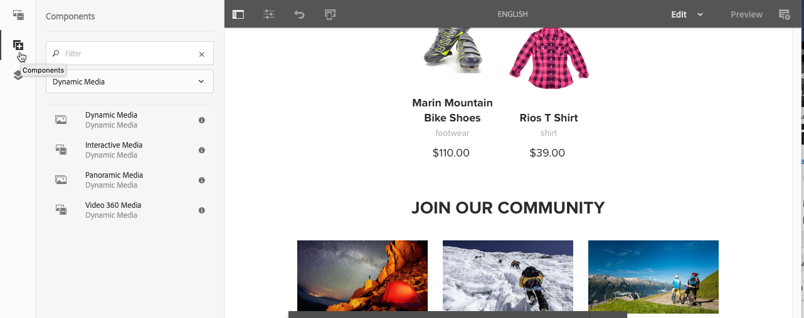
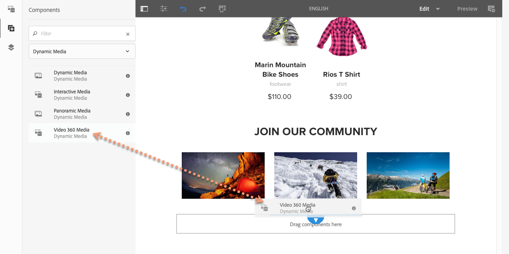
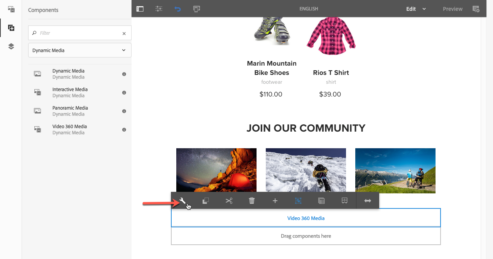
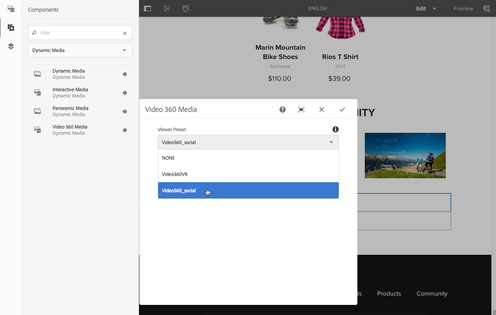

# Adding Dynamic Media Assets to Pages{#adding-dynamic-media-assets-to-pages}

To add the Dynamic Media functionality to assets you use on your websites, you can add the **Dynamic Media**,** Interactive Media**, **Panoramic Media**, or **Video 360 Media** component directly on the page. You do this by entering Layout mode and enabling the Dynamic Media components. Then you can add these components to the page and add assets to the component. The Dynamic Media components are smart - they know whether you are adding an image or a video and the configuration options available change accordingly.

You add Dynamic Media assets directly to the page if you are using AEM as your WCM. If you are using a third-party for your WCM, either [link](/assets/using/linking-urls-to-yourwebapplication.md) or [embed](/assets/using/embed-code.md) your assets. For a responsive third-party web site, see [delivering optimized images to a responsive site](/assets/using/responsive-site.md).

>[!NOTE]
>
>You must publish assets before adding them to pages in AEM. See [Publishing Dynamic Media Assets](/assets/using/publishing-dynamicmedia-assets.md).

## Adding a Dynamic Media component to a page {#adding-a-dynamic-media-component-to-a-page}

Adding a Dynamic Media, Interactive Media, Panoramic Media, or Video 360 Media component to a page is the same as adding a component to any page. The Dynamic Media components are described in the following sections.

1. In AEM, open the page where you want to add the Dynamic Media component.
1. In the left pane, tap the **Components **icon, then filter for Dynamic Media.

   If no Dynamic Media components are available, you need to enable the Dynamic Media components. See [Editing Page Templates](/help/sites-authoring/templates.md#editing-templates-template-authors) for more information. 

   

1. Drag a **Dynamic Media** component and drop it in the desired location on the page.

   In the example below, the **Video 360 Media** component is being used.

   

1. Hover the mouse pointer directly on the component. When the component is surrounded by a blue box, tap once to display the component's toolbar. Tap the** Configuration** (wrench)** **icon**.**

   

1. Depending on the Dynamic Media component you dropped onto the page, a configuration dialog box opens. [Set the component's options](../../assets/using/adding-dynamic-media-assets-to-pages.md#dynamic-media-components) as necessary.

   The example below shows the Dynamic Media **Video 360 Media** component dialog box and the options available from the Viewer Preset drop-down list.

   

   The Dynamic Media Video 360 Media component.

1. When you are finished, near the upper-right corner of the dialog box, tap the checkmark to save your changes.

## Localizing Dynamic Media Components {#localizing-dynamic-media-components}

You can localize Dynamic Media components in one of two ways:

* Within a web page in Sites, open **Properties** and select the **Advanced** tab. Select the desired language for localization.

  

* From the site selector, select the desired page or page group. Tap **Properties** and select the **Advanced** tab. Select the desired language for localization.

  >[!NOTE]
  >
  >Please note that not all languages available in the **Language** menu currently have tokens assigned.

## Dynamic Media Components {#dynamic-media-components}

Dynamic Media components are available when you tap the **Components** icon, then filter on **Dynamic Media**.

The Dynamic Media components that are available include the following:

* Dynamic Media - Use for such assets as images, video, eCatalogs, and spin sets.  
* Interactive Media - Use for any interactive assets such as interactive video, interactive images, or carousel sets.
* Panormic Media - Use for panoramic image or panoramic VR image assets.
* Video 360 Media - Use for 360 video and 360 VR video assets.

>[!NOTE]
>
>These components are not available by default and need to be made available by way of the template editor before using. [After they are made available i](/help/sites-authoring/templates.md#editing-templates-template-authors)n the template editor, you can add the components to your page as you would any other AEM component.

 

### Dynamic Media component {#dynamic-media-component}

The Dynamic Media component is smart - depending on whether you add an image or a video, you have various options. The component supports image presets, image-based viewers such as image sets, spin sets, mixed media sets, and video. In addition, the viewer is responsive - the size of the screen changes automatically based on screen size. All viewers are HTML5 viewers.

>[!NOTE]
>
>If your web page has the following:
>
>* Multiple instances of the Dynamic Media component being used on the same page.
>* Each instance uses the same asset type.
>
>Be aware that assigning a different viewer preset to each Dynamic Media component on that page is not supported.
>
>You can, however, use the same viewer preset for all Dynamic Media components that use assets of the same type, within the page.

When you add the Dynamic Media component, and **Dynamic Media Settings** is blank or you cannot add an asset properly, check the following:

* You have [enabled Dynamic Media](../../assets/using/config-dynamic.md). Dynamic Media is disabled by default.
* The image has a pyramid tiff file. Images imported before dynamic media is enabled do not have a pyramid tiff file.

#### When working with images {#when-working-with-images}

The Dynamic Media component lets you add dynamic images, including image sets, spin sets, and mixed media sets. You can zoom in, zoom out, and if applicable turn an image within a spin set or select an image from another type of set.

You can also configure the viewer preset, image preset, or image format directly in the component. To make an image responsive you can either set the breakpoints or apply a responsive image preset.

You can edit the following Dynamic Media Settings by tapping the **Edit** icon in the component and then **Dynamic Media Settings**.

>[!NOTE]
>
>By default, the Dynamic Media image component is adaptive. If you want to make it a fixed size, set it in the component in the **Advanced** tab with the **Width** and **Height**.

**Viewer preset** Select an existing viewer preset from the drop-down menu. If the viewer preset you are looking for is not visible, you may need to make it visible. See Managing Viewer Presets. You cannot select a viewer preset if you are using an image preset and vice versa.

This is the only option available if you are viewing image sets, spin sets, or mixed media sets. The viewer presets displayed are also smart - only relevant viewer presets appear.

**Viewer modifiers** Viewer modifiers take the form of name=value pair with a & delimiter and let you change viewers as outlined in the Viewers Reference Guide. An example of a viewer modifier is `posterimage=img.jpg&caption=text.vtt,1` which sets a different image for the video thumbnail and associates a closed caption/subtitle file with the video.

**Image preset** Select an existing image preset from the drop-down menu. If the image preset you are looking for is not visible, you may need to make it visible. See Managing Image Presets. You cannot select a viewer preset if you are using an image preset and vice versa.

This option is not available if you are viewing image sets, spin sets, or mixed media sets.

**Image Modifiers** You can apply image effects by supplying additional image commands. These are described in Image Presets and the Image Serving Command reference.

This option is not available if you are viewing image sets, spin sets, or mixed media sets.

**Breakpoints** If you are using this asset on a responsive site, you need to add the image breakpoints. Image breakpoints need to be separated by commas (,). This option works when there is no height or width defined in an image preset.

This option is not available if you are viewing image sets, spin sets, or mixed media sets.

You can edit the following Advanced Settings by tapping **Edit** in the component.

**Title** Change the title of the image.

**Alt Text** Add a title to the image for those users who have graphics turned off.

This option is not available if you are viewing image sets, spin sets, or mixed media sets.

**URL, Open in** You can set an asset to open a link. Set the URL and in Open in indicate whether you want it to open in the same window or a new window.

This option is not available if you are viewing image sets, spin sets, or mixed media sets.

**Width and Height** Enter value in pixels if you want the image to be a fixed size. Leaving these values blank makes the asset adaptive.

#### When working with Video {#when-working-with-video}

Use the Dynamic Media component to add dynamic video to your web pages. When you edit the component you can choose to use a predefined video viewer preset for playing the video on the page.

You can edit the following Dynamic Media Settings by clicking **Edit** in the component.

>[!NOTE]
>
>By default, the Dynamic Media video component is adaptive. If you want to make it a fixed size, set it in the component with the **Width** and **Height **in** **the** Advanced **tab.

**Viewer preset** Select an existing video viewer preset from the drop-down menu. If the viewer preset you are looking for is not visible, you may need to make it visible. See Managing Viewer Presets.

**Viewer modifiers** Viewer modifiers take the form of name=value pair with a & delimiter and let you change viewers as outlined in the Adobe Viewers Reference Guide. An example of a viewer modifier is `posterimage=img.jpg&caption=text.vtt,1`

With viewer modifiers, you for example, can do the following:

* Associate a caption file with a video: [https://marketing.adobe.com/resources/help/en_US/s7/viewers_ref/r_html5_video_viewer_url_caption.html](https://marketing.adobe.com/resources/help/en_US/s7/viewers_ref/r_html5_video_viewer_url_caption.html)
* Associate a navigation file with a video: [https://marketing.adobe.com/resources/help/en_US/s7/viewers_ref/r_html5_video_viewer_url_navigation.html](https://marketing.adobe.com/resources/help/en_US/s7/viewers_ref/r_html5_video_viewer_url_navigation.html)

You can edit the following Advanced Settings by clicking **Edit** in the component.

**Title** Change the title of the video.

**Width and Height** Enter value in pixels if you want the video to be a fixed size. Leaving these values blank makes it adaptive.

#### When working with Smart Crop {#when-working-with-smart-crop}

Use the Dynamic Media component to add Smart Crop image assets to your web pages. When you edit the component you can choose to use a predefined video viewer preset for playing the video on the page.

See also [Image Profiles](/assets/using/image-profiles.md).

You can edit the following Dynamic Media Setting by clicking **Edit** in the component.

>[!NOTE]
>
>By default, the Dynamic Media image component is adaptive. If you want to make it a fixed size, set it in the component in the **Advanced** tab with the **Width** and **Height**.

**Image Modifiers** You can apply image effects by supplying additional image commands. These are described in Image Presets and the Image Serving Command reference.

This option is not available if you are viewing image sets, spin sets, or mixed media sets.

You can edit the following Advanced Settings by clicking **Edit** in the component.

**Title** Change the title of the Smart Crop image.

**Alt Text** Add a title to the smart crop image for those users who have graphics turned off.

This option is not available if you are viewing image sets, spin sets, or mixed media sets.

**URL, Open in** You can set an asset to open a link. Set the URL and in Open in indicate whether you want it to open in the same window or a new window.

This option is not available if you are viewing image sets, spin sets, or mixed media sets.

**Height, Width** Enter value in pixels if you want the smart crop image to be a fixed size. Leaving these values blank makes it adaptive.

### Interactive Media Component {#interactive-media-component}

Interactive Media component is for those assets that have interactivity on them such hotspots or image maps. If you have an interactive image, interactive video, or carousel banner, use the **Interactive Media** component.

The Interactive Media component is smart - depending on whether you add an image or a video, you have various options. In addition, the viewer is responsive - the size of the screen changes automatically based on screen size. All viewers are HTML5 viewers.

>[!NOTE]
>
>If your web page has the following:
>
>* Multiple instances of the Interactive Media component being used on the same page.
>* Each instance uses the same asset type.
>
>Be aware that assigning a different viewer preset to each Interactive Media component on that page is not supported.
>
>You can, however, use the same viewer preset for all Interactive Media components that use assets of the same type, within the page.

You can edit the following **General** settings by clicking **Edit** in the component.

**Viewer preset** Select an existing viewer preset from the drop-down menu. If the viewer preset you are looking for is not visible, you may need to make it visible. Viewer Presets must be published before they can be used. See Managing Viewer Presets.

**Title** Change the title of the video.

**Width and Height** Enter value in pixels if you want the video to be a fixed size. Leaving these values blank makes it adaptive.

You can edit the following **Add To Cart** settings by clicking **Edit** in the component.

**Show Product Asset** By default, this value is selected. The product asset shows an image of the product as defined in the Commerce module. Clear the check mark to not show the product asset.

**Show Product Price** By default, this value is selected. Product price shows the price of the item as defined in the Commerce module. Clear the check mark to not show the product price.

**Show Product Form** By default, this value is not selected. The Product Form includes any product variants such as size and color. Clear the check mark to not show the product variants.

### Panoramic Media Component {#panoramic-media-component}

Panoramic Media component is for those assets that are spherical panoramic images. Such images provide a 360° viewing experience of a room, property, location, or landscape. For an image to qualify as a spherical panorama, it must have either one OR both of the following:

* An aspect ratio of 2:1.
* Tagged with the keywords “equirectangular” or (“spherical” + “panorama”) or (“spherical” + “panoramic”). See [Using Tags](/help/sites-authoring/tags.md).

Both the aspect ratio and keyword criteria apply to panoramic assets for the asset details page and the "Panoramic Media" WCM component.

>[!NOTE]
>
>If your web page has the following:
>
>* Multiple instances of the Panoramic Media component being used on the same page.
>* Each instance uses the same asset type.
>
>Be aware that assigning a different viewer preset to each Panoramic Media component on that page is not supported.
>
>You can, however, use the same viewer preset for all Panoramic Media components that use assets of the same type, within the page.

You can edit the following** **setting by clicking **Configure** in the component.

**Viewer Preset** Select an existing viewer from the Viewer preset drop-down menu.

If the viewer preset you are looking for is not visible, check to ensure that it is published. You must publish viewer presets before you can use them. See [Managing Viewer Presets](../../assets/using/managing-viewer-presets.md).

### Video 360 Media Component {#video-media-component}

Use the Video 360 Media component to render equirectangular video on your web page for an immersive viewing experience of a room, property, location, landscape, or medical procedure.

During playback on a flat display the user has control of the viewing angle; playback on mobile devices usually leverage their built-in gyroscopic controls.

The viewer includes native support for the delivery of 360 video assets. By default, no additional configuration is necessary for viewing or playback. You deliver 360 Video using standard video extensions such as .mp4, .mkv, and .mov. The most common codec is H.264.

You can edit the following** **setting by clicking **Configure** in the component.

**Viewer Preset** Select an existing viewer from the Viewer preset drop-down menu. Use Video360VR for end users who use virtual reality glasses. Includes basic video playback controls and social media features. Use Video360_social which includes basic video playback controls. Video rendering is done in stereo mode. Manual point-of-view control is off but gyroscopic control is on. There is no social media features.

If the viewer preset you are looking for is not visible, check to ensure that it is published. You must publish viewer presets before you can use them. See [Managing Viewer Presets](../../assets/using/managing-viewer-presets.md).

### Using HTTP/2 to delivery Dynamic Media assets {#using-http-to-delivery-dynamic-media-assets}

HTTP/2 is the new, updated web protocol that improves the way browsers and servers communicate. It provides faster transfer of information and reduces the amount of processing power that is needed. Delivery of Dynamic Media assets can now be over HTTP/2 which provides better response and load times.

See [HTTP2 Delivery of Content](/assets/using/http2.md) for complete details on getting started using HTTP/2 with your Dynamic Media account.

>[!MORE_LIKE_THIS]
>
>* [Using the Video Player in AEM Dynamic Media](https://helpx.adobe.com/experience-manager/kt/assets/using/dynamic-media-video-player-feature-video-use.html)
>* [Using Interactive Video with AEM Dynamic Media](https://helpx.adobe.com/experience-manager/kt/assets/using/dynamic-media-interactive-video-feature-video-use.html)
>* [Understanding the Asset Viewer with AEM Dynamic Media](https://helpx.adobe.com/experience-manager/kt/assets/using/dynamic-media-viewer-feature-video-understand.html)
>* [Using Custom Video Thumbnail with AEM Dynamic Media](https://helpx.adobe.com/experience-manager/kt/assets/using/dynamic-media-video-thumbnails-feature-video-use.html)
>* [Understanding Color Management with AEM Dynamic Media](https://helpx.adobe.com/experience-manager/kt/assets/using/dynamic-media-color-management-technical-video-setup.html)
>* [Using Image Sharpening with AEM Dynamic Media](https://helpx.adobe.com/experience-manager/kt/assets/using/dynamic-media-image-sharpening-feature-video-use.html)
