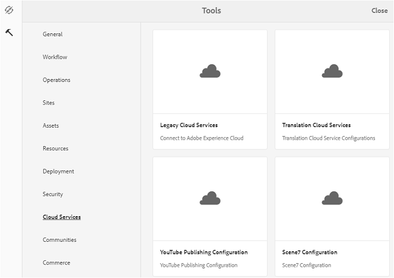
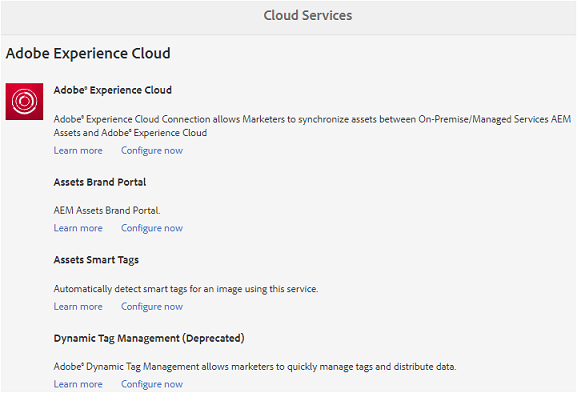
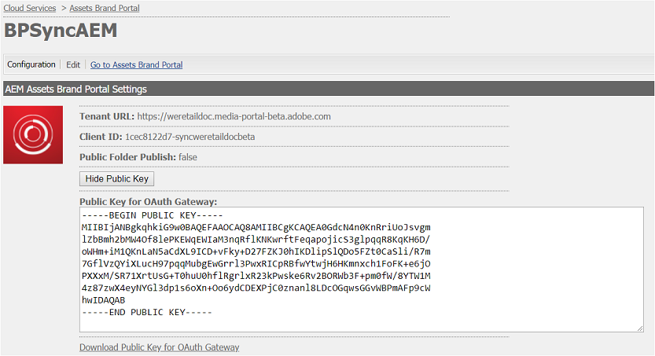

# Configure AEM Assets integration with Brand Portal{#configure-aem-assets-integration-with-brand-portal}

If you are an Adobe Experience Manager (AEM) Assets Brand Portal customer, you can integrate AEM Assets with Brand Portal to enable publishing of assets to Brand Portal. You can set up this integration through Adobe.io interface.

First, create an application, which includes an authentication mechanism, in the Marketing Cloud public gateway. Next, create a profile in your AEM Assets instance using the application ID that you obtain from the gateway.

Use this configuration to publish assets from AEM Assets to Brand Portal. At the backend, the AEM server authenticates your profile with the gateway and then integrates AEM Assets with Brand Portal.

>[!NOTE]
>
>The User Interface for configuring oAuth integrations is hosted in [https://legacy-oauth.cloud.adobe.io/](https://legacy-oauth.cloud.adobe.io/), which was earlier hosted in [https://marketing.adobe.com/developer/](https://marketing.adobe.com/developer/).

## Create JWT application {#create-jwt-application}

1. Log in to [https://legacy-oauth.cloud.adobe.io/](https://legacy-oauth.cloud.adobe.io/) with your Adobe ID. You reach ** JWT  Applications** page.

   >[!NOTE]
   >
   >You can create an application ID only if you are the system administrator of your organization. Tenant is the technical name for your organization that is registered with Adobe Marketing Cloud.

1. Select **Add Application **to create an application.

   <!--
   Comment Type: draft

   <li>
From the <strong>Client Credentials</strong> list, select <strong>Service Account (JWT Assertion)</strong>, which is a server-to-server communication service for server authentication.
 </li>
   -->

1. Specify a name for the application and an optional description.
1. From the **Organization **list, select the organization for which you want to synchronize assets.
1. From the **Scope** list, select **dam-read**, **dam-sync**, **dam-write**, and **cc-share**.
1. Tap/ click **Add**. A JWT Service application is created. You can edit the application and Save.
1. Copy the Application ID that is generated for the new application.

   >[!NOTE]
   >
   >Ensure that you do not inadvertently copy the application secret instead of application ID.

## Create a new cloud configuration {#create-a-new-cloud-configuration}

1. From the **Navigation** page of your local AEM Assets instance, tap/click the **Tools** icon on the left.

   

1. Navigate to **Cloud Services &gt; Legacy Cloud Services**.

   

1. In the **Cloud Services** page, locate the **Assets Brand Portal** service under **Adobe Experience Cloud**.

   

1. Tap/ click the **Configure now** link below the service to display the **Create Configuration** dialog.
1. In the **Create Configuration** dialog, specify a title and name for the new configuration and tap/click **Create**. 

   

1. In the **AEM Assets Brand Portal Replication** dialog, specify the URL of your organization in the **Tenant URL **field. 
1. In the **Client ID** field, paste the application ID you copied at the end of the procedure [Create an application](../../assets/using/brand-portal-configuring-integration.md#create-jwt-application). Click **OK**.

   

1. To make the assets (published from AEM) publicly available to general users of Brand Portal, enable the **Public Folder Publish** check box .

   >[!NOTE]
   >
   >The option to enable **Public Folder Publish **is available in AEM 6.3.2.1 onwards.

1. From the **Brand Portal Configuration** page, tap/click **Display Public Key** to display the public key generated for your instance.

   

   Alternatively, click **Download Public Key for OAuth Gateway** to download the file containing the public key. Then, open the file to display the public key.

## Enable integration {#enable-integration}

1. Display the public key using one of the following methods mentioned in the last step of the procedure [Add a new configuration to Marketing Cloud](../../assets/using/brand-portal-configuring-integration.md#create-a-new-cloud-configuration).

    * Click the **Display Public Key** button to display the key.
    * Open the downloaded file containing the key.

1. Open the Marketing Cloud Developer Connection interface and click the application you created in [Create an application](../../assets/using/brand-portal-configuring-integration.md#create-jwt-application).
1. Paste the public key into the **Public Key** field of the configuration interface
1. Tap/click **Save**. A message confirms that the application has been updated.

## Test the integration {#test-the-integration}

1. From the **Navigation** page of your local AEM Assets instance, click the **Tools** icon on the left.

   

1. Navigate to **Deployment** &gt; **Replication**.

   

1. In the **Replication** page, tap/click **Agents on author**.

   

1. To verify the connection between AEM Author and Brand Portal, open any of the four replication agents and click **Test Connection**.

   >[!NOTE]
   >
   >The replication agents work in parallel and share the job distribution equally, thereby increasing the publishing speed by four times the original speed. After the cloud service is configured, additional configuration is not required to enable the replication agents that are activated by default to enable parallel publishing of multiple assets.

   >[!NOTE]
   >
   >Avoid disabling any of the replication agents, as it can cause the replication of some of the assets to fail.

   

1. Look at the bottom of the test results to verify that the replication succeeded.

   

After replication succeeds, you can publish assets, folders, and Collections to Brand Portal. For details, see:

* [Publish assets and folders to Brand Portal](../../assets/using/brand-portal-publish-folder.md)
* [Publish Collections to Brand Portal](../../assets/using/brand-portal-publish-collection.md)

## Publish assets to Brand Portal {#publish-assets-to-brand-portal}

After replication succeeds, you can publish assets, folders, and Collections  to  Brand Portal. To publish assets to Brand Portal, follow these steps:

>[!NOTE]
>
>Adobe recommends staggered publishing, preferably during non-peak hours, so that the AEM author does not occupy excess resources.

1. From the Assets console, hover over the desired assets and select **Publish** option from the quick actions.

   Alternatively, select the assets you want to publish to Brand Portal.

   

1. **Publish assets now**

   To publish the selected assets to Brand Portal, do either of the following:

    * From the toolbar, select **Quick Publish**. Then from the menu, select **Publish to Brand Portal**.
    
    * From the toolbar, select **Manage Publication**.

    1. Then from the **Action** select **Publish to Brand Portal, **and from **Scheduling** select **Now**. Tap/ click **Next.**
    1. Within **Scope**, confirm your selection and tap/ click **Publish to Brand Portal**.

   A message appears stating that the assets have been queued up for publishing to Brand Portal. Log in to the Brand Portal interface to see the published assets.

   **Publish assets later**

   To schedule publishing the assets to Brand Portal to a later date or time:

    1. Once you have selected assets/ folders to publish, select **Manage Publication **from the tool bar at the top.
    1. On** Manage Publication** page, select **Publish to Brand Portal **from **Action** and select** Later **from **Scheduling**.
    
       

    1. Select an **Activation date **and specify time. Tap/ click **Next**.
    1. Select an **Activation date **and specify time. Tap/ click **Next**.
    1. Specify a Workflow title under **Workflows**. Tap/ click **Publish Later**.
    
       

1. Log in to Brand Portal to see whether the published assets are available on  Brand  Portal interface.

   

