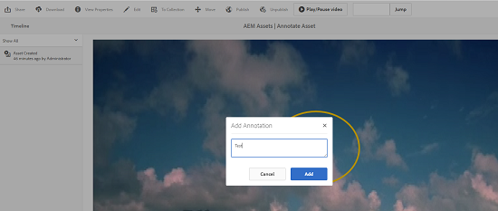

# Manage video assets{#manage-video-assets}

Learn how to manage and edit the video assets in Adobe Experience Manager (AEM) Assets. Also, if you are licensed to use Dynamic Media, see the [Dynamic Media Video documentation](../../assets/using/video.md).

## Upload and Preview video assets {#upload-and-preview-video-assets}

Adobe Experience Manager Assets generates previews for video assets with the extension MP4. If the format of the asset is not MP4, install the FFmpeg pack to generate a preview. FFmpeg creates video renditions of type OGG and MP4. You can preview these renditions in the AEM Assets user interface.

1. In the Digital Assets folder or subfolders, navigate to the location where you want to add digital assets.
1. To upload the asset, click or tap **Create** from the toolbar and then choose **Files**. Alternatively, drop it directly in the assets area. See [Uploading assets](../../assets/using/managing-assets-touch-ui.md#uploading-assets) for details around the upload operation.
1. To preview a video in the Card view, click the **Play** button on the video asset.

   

   You can pause or play video in the Card view only. The Play/Pause button is not available in the list view.

1. To preview the video in the asset details page, click/tap the Edit icon on the card.

   The video plays in the native video player of the browser. You can play, pause, control the volume, and zoom the video to full screen.

   

## Configuration to upload video assets that are larger than 2 GB {#configuration-to-upload-video-assets-that-are-larger-than-gb}

By default, the AEM Assets Touch UI does not let you upload any assets that are larger than 2 GB because of a file size limit. However, you can overwrite this limit by going into CRXDE Lite and creating a node under the `/apps`directory. The node must have the same node name, directory structure, and comparable node properties of order.

>[!NOTE]
>
>The AEM Classic user interface does not have a 2 GB file size limit restriction. Also, end-to-end workflow for large video is not fully supported.

To configure a higher file size limit, perform the following steps in the */apps* directory.

1. In AEM, tap **Tools **&gt; **General** &gt; **CRXDE Lite**.
1. In CRXDE Lite, navigate to `/libs/dam/gui/content/assets/jcr:content/actions/secondary/create/items/fileupload`. To see the directory window, touch the **`>>`** icon.
1. From the toolbar, tap the **Overlay Node** button. Alternatively, select **Overlay Node** from the context menu.
1. In the **Overlay Node** dialog, tap **OK**.

   

1. Refresh the browser. The overlay node `/jcr_root/apps/dam/gui/content/assets/jcr:content/actions/secondary/create/items/fileupload` is selected.
1. In the **Properties** tab, enter the appropriate value in bytes to increase the size limit to the desired size. For example, enter the following value to increase the size limit to 30 GB:

   `{sizeLimit : "32212254720"}`

1. From the toolbar, touch **Save All**.
1. In AEM, tap **Tools** &gt; **Operations** &gt; **Web Console**.
1. On the Adobe Experience Manager Web Console Bundles page, under the Name column of the table, locate and tap **Adobe Granite Workflow External Process Job Handler**.
1. In the Adobe Granite Workflow External Process Job Handler page, set the seconds for both **Default Timeout** and **Max Timeout** fields to `18000` (five hours).
1. Tap **Save**.
1. In AEM, tap **Tools** &gt; **Workflow** &gt; **Models**.
1. On the Workflow Models page, select **Dynamic Media Encode Video**, then tap **Edit**.
1. On the workflow page, double-tap the **Dynamic Media Video Service Process** component.
1. In the Step Properties dialog box, under the **Common** tab, expand **Advanced Settings**.
1. In the Timeout field, specify a value of `18000`, then tap **OK** to return to the **Dynamic Media Encode Video** workflow page.
1. Near the top of the page, below the Dynamic Media Encode Video page title, tap **Save**.

## Publish video assets {#publish-video-assets}

After your video assets are published, they are available to you for including in a web page by way of a URL or embedding on a web page.

See [Publishing Assets](/assets/using/publishing-dynamicmedia-assets.md).

## Annotate video assets {#annotate-video-assets}

1. From the Assets console, click or tap the Edit icon on the asset card to display the asset details page.
1. To play the video, click/tap the Preview icon.
1. To annotate the video, click the **Annotate** button. An annotation is added at the particular timepoint (frame) in the video.

   While annotating, you can draw on the canvas and include a comment with the drawing. Comments are auto-saved.

   

   To exit the annotation wizard, click **Close**.

1. To jump to a specific point in the video, specify the time in seconds in the **text** field and click **Jump**. For example, to skip the first 10 seconds of video, enter **20** in the **text** field.

   

1. To view it in the timeline, click an annotation. To delete the annotation from the timeline, click **Delete**.

   

