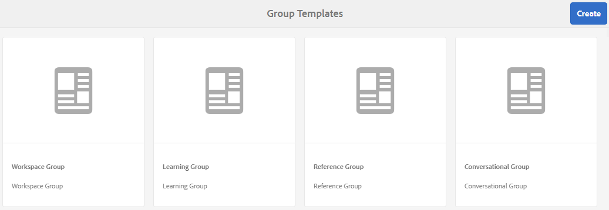

# Group Templates{#group-templates}

The Group Templates console is similar to the [Site Templates](/help/communities/sites.md) console. Both are blueprints for a set of pre-wired pages and features which form a community site. The difference is that a site template is for the main community and a group template is for a community group, a sub-community nested within the main community.

A community group is incorporated into a site template by including the [Groups function](/help/communities/functions.md#groups-function) (which may not be the first nor only function in the template).

As of Communities [feature pack 1](/help/communities/deploy-communities.md#latestfeaturepack), it is possible to nest groups by including the Groups function within a group template.

The moment an action is taken to create a new community group, the group's template (structure) is selected. The selection depends on how the Groups function was configured when added to the site or group template.

>[!NOTE]
>
>The consoles for the creation of [community sites](/help/communities/sites-console.md), [community site templates](/help/communities/sites.md), [community group templates](/help/communities/tools-groups.md) and [community functions](/help/communities/functions.md) are for use only in the author environment.

## Group Templates Console {#group-templates-console}

To reach the groups templates console in the AEM Author environment:

* Select **Tools | Communities | Group Templates,** from global navigation.

This console displays the templates from which a [community site](/help/communities/sites-console.md) can be created and allows new group templates to be created.

## Create Group Template {#create-group-template}

To get started creating a new group template, select `Create`

This will bring up the Site Editor panel which contains 3 sub-panels:

### Basic Info {#basic-info}

On the Basic Info panel, a name, description and whether the template is enabled or disabled are configured:

* **New Group Template Name **
  the template name id

* **Description**

  the template description

* **Disabled/Enabled**

  a toggle switch controlling whether the template is referenceable

#### Thumbnail {#thumbnail}

(Optional) Select the Upload Image icon to display a Thumbnail along with the Name and Description to creators of community sites.

#### Structure {#structure}

>[!CAUTION]
>
>If working with AEM 6.1 Communities FP4 or earlier, do not add a groups function to a group template.
>
>The nested groups feature is available as of Communities [FP1](/help/communities/communities.md#latestfeaturepack).
>
>It is still not allowed to add a Groups function as the first or only function in a template.

To add community functions, drag from the right side to the left in the order the site menu links should appear. Styles will be applied to the template during creation of the site.

For example, if you want a forum, drag the forum function from the library and drop under the template builder. This will result in the forum configuration dialog opening. See the [functions console](/help/communities/functions.md) for information about the configuration dialogs.

Continue drag-and-drop of any other community functions desired for a sub-community site (group) based on this template.

Once all desired functions have been dropped into the template builder area and configured, select **Save **in the upper right corner.

## Edit Group Template {#edit-group-template}

When viewing community groups in the main [Group Templates console](#group-templates-console), it is possible to select an existing group template for edit.

Editing a group template will not affect community sites already created from the template. It is possible to directly [edit a community site](/help/communities/sites-console.md#modify-structure)'s structure instead.

This process provides the same panels as [creating a group template](#create-group-template).
