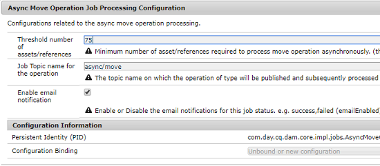

# Asynchronous Operations {#asynchronous-operations}

To reduce negative impact on performance, Adobe Experience Manger processes certain long-running and resource-intensive operations asynchronously.

These operations include:

* Deleting many assets
* Moving many assets or assets with many references
* Exporting/importing asset metadata in bulk
* Fetching assets, which are above the threshold limit set, from a remote Experience Manager deployment
* Moving pages
* Rolling out Live Copies

Asynchronous processing involves enqueuing multiple jobs and running them in a serial manner subject to the availability of system resources.

You can view the status of asynchronous jobs from the **[!UICONTROL Async Job Status]** dashboard at **Global Navigation** -&gt; **Tools** -&gt; **Operations** -&gt; **Jobs**.

>[!NOTE]
>
>By default, asynchronous jobs run in parallel. If *`n`* is the number of CPU cores, *`n/2`* jobs can run in parallel, by default. To use custom settings for the job queue, modify the **[!UICONTROL Async Operation Default Queue Config]** and the A**sync Operation Page Move and Rollout Config** from the web console.
>
>For more information, see [queue configurations](https://sling.apache.org/documentation/bundles/apache-sling-eventing-and-job-handling.html#queue-configurations).

## Monitor the Status of Asynchronous Operations {#monitor-the-status-of-asynchronous-operations}

Whenever AEM processes an operation asynchronously, you receive a notification in your inbox and through email (if enabled).

To view the status of the asynchronous operations in detail, navigate to the **[!UICONTROL Async Job Status]** page.

1. In the Experience Manager interface click **[!UICONTROL Operations]** &gt; **[!UICONTROL Jobs]**.

1. In the **[!UICONTROL Async Job Status]** page, review the details of the operations.

    

   To determine the progress of a particular operation, see the value in the **[!UICONTROL Status]** column. Depending upon the progress, one of the following statuses is displayed:

   * **[!UICONTROL Active]**: The operation is being processed

   * **[!UICONTROL Success]**: The operation is complete

   * **[!UICONTROL Fail]** or **[!UICONTROL Error]**: The operation could not be processed

   * **[!UICONTROL Scheduled]**: The operation is scheduled for processing a later time

1. To stop an active operation, select it from the list and click **[!UICONTROL Stop]** from the toolbar.

   

1. To view extra details, for example description and logs, select the operation and click **[!UICONTROL Open]** from the toolbar.

   

   The job details page is displayed.

   

1. To delete the operation from the list, select **[!UICONTROL Delete]** from the toolbar. To download the details in a CSV file, click **[!UICONTROL Download]**.

   >[!NOTE]
   >
   >You cannot delete a job if its status is either **Active** or **Queued**.

## Purge Completed Jobs {#purging-completed-jobs}

AEM runs a purge job everyday at 01:00 to delete completed asynchronous jobs that are more than a day old.

You can modify the schedule for the purge job and the duration for which details of completed jobs are retained before they are deleted. You can also configure the maximum number of completed jobs for which details are retained at any point of time.

1. From the Global Navigation click **[!UICONTROL Tools]** &gt; **[!UICONTROL Operations]** &gt; **[!UICONTROL Web Console]**.
1. Open the **[!UICONTROL Adobe Granite Async Jobs Purge Scheduled Job]** job.
1. Specify:
   * The threshold number of days after which completed jobs are deleted.
   * The maximum number of jobs for which details are retained in history.
   * The cron expression for when the purge should run.

   

1. Save the changes.

## Configure Asynchronous Processing {#configuring-asynchronous-processing}

You can configure the threshold number of assets, pages, or references for AEM to process a particular operation asynchronously as well as toggle email notifications for when the jobs are processed.

### Configure Asynchronous Asset Delete Operations {#configuring-synchronous-delete-operations}

If the number of assets or folders to be deleted exceeds the threshold number, the delete operation is performed asynchronously.

1. From the Global Navigation click **[!UICONTROL Tools]** &gt; **[!UICONTROL Operations]** &gt; **[!UICONTROL Web Console]**.
1. From the web console, open the **[!UICONTROL Async Process Default Queue Configuration.]**
1. In the **[!UICONTROL Threshold number of assets]** box, specify the threshold number of assets/folders for asynchronous processing of delete operations.

   

1. Check the option **Enable email notification** to receive email notifications for this job status. e.g. success, failed.
1. Save the changes.

### Configure Asynchronous Asset Move Operations {#configuring-asynchronous-move-operations}

If the number of assets/folders or references to be moved exceeds the threshold number, the move operation is performed asynchronously.

1. From the Global Navigation click **[!UICONTROL Tools]** &gt; **[!UICONTROL Operations]** &gt; **[!UICONTROL Web Console]**.
1. From the web console, open the **[!UICONTROL Async Move Operation Job Processing Configuration.]**
1. In the **[!UICONTROL Threshold number of assets/references]** box, specify the threshold number of assets/folders or references for asynchronous processing of move operations.

   

1. Check the option **Enable email notification** to receive email notifications for this job status. e.g. success, failed.
1. Save the changes.

### Configure Asynchronous Page Move Operations {#configuring-asynchronous-page-move-operations}

If the number of references to the page(s) to be moved exceeds the threshold number, the move operation is performed asynchronously.

1. From the Global Navigation click **[!UICONTROL Tools]** &gt; **[!UICONTROL Operations]** &gt; **[!UICONTROL Web Console]**.
1. From the web console, open the **[!UICONTROL Async Page Move Operation Job Processing Configuration.]**
1. In the **[!UICONTROL Threshold number of references]** field, specify the threshold number of references for asynchronous processing of page move operations.

   

1. Check the option **Enable email notification** to receive email notifications for this job status. e.g. success, failed.
1. Save the changes.

### Configure Asynchronous MSM Operations {#configuring-asynchronous-msm-operations}

1. From the Global Navigation click **[!UICONTROL Tools]** &gt; **[!UICONTROL Operations]** &gt; **[!UICONTROL Web Console]**.
1. From the web console, open the **[!UICONTROL Async Page Move Operation Job Processing Configuration.]**
1. Check the option **Enable email notification** to receive email notifications for this job status. e.g. success, failed.

   

1. Save the changes.
