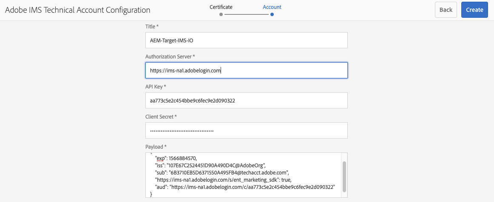
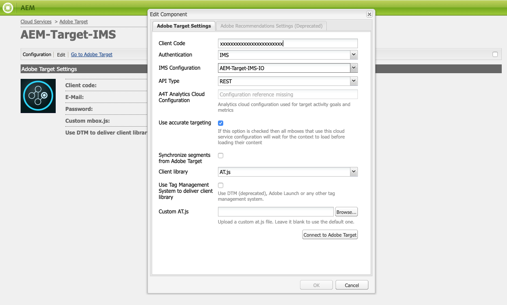

# Integration with Adobe Target using Adobe I/O{#integration-with-adobe-target-using-adobe-i-o}

The integration of AEM with Adobe Target via the Target Standard API requires the configuration of Adobe IMS (Identity Management System) and Adobe I/O.

>[!NOTE]
>
>Support for the Adobe Target Standard API is new in AEM 6.5. The Target Standard API uses IMS authentication.
>
>Using the Adobe Target Classic API in AEM is still supported for backward compatibility. The [Target Classic API uses user credentials authentication](/help/sites-administering/target-configuring.md#manually-integrating-with-adobe-target).
>
>The API selection is driven by the authentication method used for AEM/Target integration.

## Prerequisites {#prerequisites}

Before starting this procedure [Adobe Support](https://helpx.adobe.com/contact/enterprise-support.ec.html) must provision your account for:

* Adobe Console
* Adobe I/O
* Adobe Target and 
* Adobe IMS (Identity Management System)

## Configuring an IMS Configuration - Generating a Public Key {#configuring-an-ims-configuration-generating-a-public-key}

The first stage of the configuration is to create an IMS Configuration in AEM and generate the Public Key.

1. In AEM open the **Tools** menu.
1. In the **Security** section select **Adobe IMS Configurations**.
1. Select **Create** to open the **Adobe IMS Technical Account Configuration**.
1. Using the drop down under **Cloud Configuration**, select **Adobe Target**.
1. Activate **Create new certificate** and enter a new alias.
1. Confirm with **Create certificate**.

   

1. Select **Download** (or **Download Public Key**) to download the file to your local drive, so that it is ready for use when [configuring Adobe I/O for Adobe Target integration with AEM](#configuring-adobe-i-o-for-adobe-target-integration-with-aem).

   >[!CAUTION]
   >
   >Keep this configuration open, it will be needed again when [Completing the IMS Configuration in AEM](#completing-the-ims-configuration-in-aem).

   

## Configuring Adobe I/O for Adobe Target integration with AEM {#configuring-adobe-i-o-for-adobe-target-integration-with-aem}

You need to create the Adobe I/O integration with Adobe Target that AEM will use, then assign the required privileges.

### Creating the Integration {#creating-the-integration}

Open the Adobe I/O console to create an I/O integration with Adobe Target that AEM will use:

>[!NOTE]
>
>See also the [Adobe I/O tutorials](https://www.adobe.io/apis/experienceplatform/home/tutorials/alltutorials.html).

1. Open the Adobe I/O console for integrations:

    * [https://console.adobe.io/integrations](https://console.adobe.io/integrations)

1. Select **New integration**:

   >[!NOTE]
   >
   >If you already have existing integrations these will be listed and the **New integration** button will be top right.

   

1. Select **Access an API** followed by **Continue**:

   

1. Select **Adobe Target**, then **Continue**:

   

1. Add the required details for the integration configuration:

    * **Name**

      Enter the name.

    * **Description**

      A description is optional.

    * **Public Key Certificate**

      Upload the public key file; as generated under [Configuring an IMS Configuration - Generating a Public Key](#configuring-an-ims-configuration-generating-a-public-key).

      Once loaded the certificate will be listed under **Certificates**.

    * **Product Profiles**

      Product Profiles equate with Workspaces in Target that AEM can use for content export and offer creation. By default the Target Default Workspace is selected. Select any other Profiles/Workspaces that should be exposed in AEM as export destinations.

   For example:

   

1. Confirm with **Create integration**.
1. The creation will be confirmed, you can now **Continue to integration details**; these are needed for [Completing the IMS Configuration in AEM](#completing-the-ims-configuration-in-aem).

   

### Assigning privileges to the Integration {#assigning-privileges-to-the-integration}

You must now assign the required privileges to the integration:

1. Open the Adobe **Admin Console**:

    * [https://adminconsole.adobe.com](https://adminconsole.adobe.com/)

1. Navigate to **Products** (top toolbar), then select **Adobe Target - &lt;*your-tenant-id*&gt;** (from the left panel).
1. Select **Product Profiles**, then your required workspace from the list presented. For example, Default Workspace.
1. Select **Integrations**, then the required integration configuration.
1. Select **Editor** as the **Product Role**; instead of **Observer**.

## Details stored for the Adobe I/O Integration {#details-stored-for-the-adobe-i-o-integration}

From the Adobe I/O integrations console you can see a list of all your integrations:

* [https://console.adobe.io/integrations](https://console.adobe.io/integrations)

Select **View** (to the right of a specific integration entry) to show further details about the configuration. These include:

* Overview
* Insights
* Services
* Events
* JWT (JSON Web Token)

Some of these you will need to complete the Adobe I/O integration for Target in AEM.

1. **Overview**:

   

1. **JWT**:

   

## Completing the IMS Configuration in AEM {#completing-the-ims-configuration-in-aem}

Returning to AEM you can complete the IMS configuration by adding required values from the Adobe I/O integration for Target:

1. Return to the [IMS Configuration open in AEM](#configuring-an-ims-configuration-generating-a-public-key).
1. Select **Next**.

1. Here you can use the [details from Adobe I/O](#details-stored-for-the-adobe-i-o-integration):

    * **Title**: Your text.
    * **Authorization Server**: Copy/paste this from the `"aud"` line of the **Payload** section below, e.g. `"https://ims-na1.adobelogin.com"` in the example below
    * **API Key**: Copy this from the [Overview](#details-stored-for-the-adobe-i-o-integration) section of the Adobe I/O integration for Target
    * **Client Secret**: Generate this in the [Overview](#details-stored-for-the-adobe-i-o-integration) section of the Adobe I/O integration for Target, and copy
    * **Payload**: Copy this from the [JWT](#details-stored-for-the-adobe-i-o-integration) section of the Adobe I/O integration for Target

   

1. Confirm with **Create**.

1. Your Adobe Target configuration will be shown in the AEM console.

   

## Confirming the IMS Configuration {#confirming-the-ims-configuration}

To confirm that the configuration is operating as expected:

1. Open:

    * `https://localhost<port>/libs/cq/adobeims-configuration/content/configurations.html`

   For example:

    * `https://localhost:4502/libs/cq/adobeims-configuration/content/configurations.html`

1. Select your configuration.
1. Select **Check Health** from the toolbar, followed by **Check**.

   

1. If successful, you will see the message:

   

## Configuring the Adobe Target Cloud Service {#configuring-the-adobe-target-cloud-service}

The configuration can now be referenced for a Cloud Service to use the Target Standard API:

1. Open the **Tools** menu. Then, within the **Cloud Services** section, select **Legacy Cloud Services**.
1. Scroll down to **Adobe Target** and select **Configure now**.

   The **Create Configuration** dialog will open.

1. Enter a **Title** and, if you want, a **Name** (if left blank this will be generated from the title).

   You can also select the required template (if more than one is available).

1. Confirm with **Create**.

   The **Edit Component** dialog will open.

1. Enter the details in the **Adobe Target Settings** tab:

    * **Client Code**: the Adobe IMS Tenant ID

      >[!CAUTION]
      >
      >The Adobe IMS Tenant ID must be entered in the field labelled Client Code.

    * **Authentication**: IMS
    * **IMS Configuration**: select the name of the IMS Configuration
    * **API Type**: REST
    * **A4T Analytics Cloud Configuration**: Select the Analytics cloud configuration that is used for target activity goals and metrics. You need this if you are using Adobe Analytics as the reporting source when targeting content. If you do not see your cloud configuration, see note in [Configuring A4T Analytics Cloud Configuration](/help/sites-administering/target-configuring.md#configuring-a-t-analytics-cloud-configuration).
    * **Use accurate targeting**: By default this check box is selected. If selected, the cloud service configuration will wait for the context to load before loading content. See note that follows.
    * **Synchronize segments from Adobe Target**: Select this option to download segments that are defined in Target to use them in AEM. You must select this option when the API Type property is REST, because inline segments are not supported and you always need to use segments from Target. (Note that the AEM term of 'segment' is equivalent to the Target 'audience'.)
    * **Client library**: Select whether you want the AT.js client library, or mbox.js (deprecated).
    * **Use Tag Management System to deliver client library**: Use DTM (deprecated), Adobe Launch or any other tag management system.
    * **Custom AT.js**: Leave blank if you checked the Tag Management box or to use the default AT.js. Alternatively upload your custom AT.js. Only appears if you have selected AT.js.

   >[!NOTE]
   >
   >[Configuration of a Cloud Service to use the Target Classic API](/help/sites-administering/target-configuring.md#manually-integrating-with-adobe-target) has been deprecated (uses the Adobe Recommendations Settings tab).

   For example:

   

1. Click **Connect to Target** to initialize the connection with Adobe Target.

   If the connection is successful, the message **Connection successful** is displayed.

1. Select **OK** on the message, followed by **OK** on the dialog to confirm the configuration.
1. You can now proceed to [Adding a Target Framework](/help/sites-administering/target-configuring.md#adding-a-target-framework) to configure ContextHub or ClientContext parameters that will be sent to Target. Note this may not be required for exporting AEM Experience Fragments to Target.

