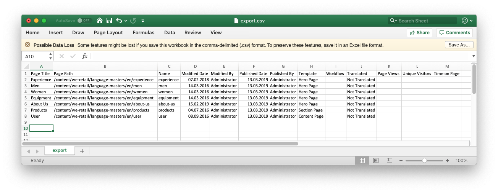

# Export to CSV{#export-to-csv}

**Create CSV Report** enables you to export information about your pages to a CSV file on your local system.

* The file downloaded is called `export.csv`
* The contents are dependent on the properties you select.
* You can define the path together with the depth of the export.

>[!NOTE]
>
>The download feature and default destination of your browser is used.

The **Create CSV Export** wizard allows you to select:

* Properties to export
    * Metadata
        * Name
        * Modified
        * Published
        * Template
        * Workflow
    * Translation
      * Translated
    * Analytics
        * Page Views
        * Unique Visitors
        * Time on Page
* Depth
    * Parent Path
    * Direct children only
    * Additional levels of children
    * Levels

The resulting `export.csv` file can be opened in Excel or any other compatible application.

 

The create **CSV Report** option is available when browsing the **Sites** console (in List view): it is an option of the **Create** drop down menu:

To create a CSV export:

1. Open the **Sites** console, navigate to the required location if required.
1. From the toolbar, select **Create** then **CSV Report** to open the wizard:

   

1. Select the required properties to export.
1. Select **Create**.
